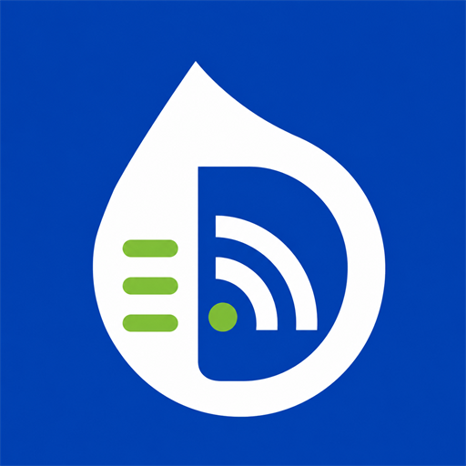
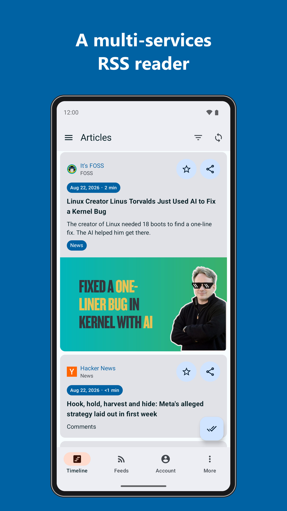
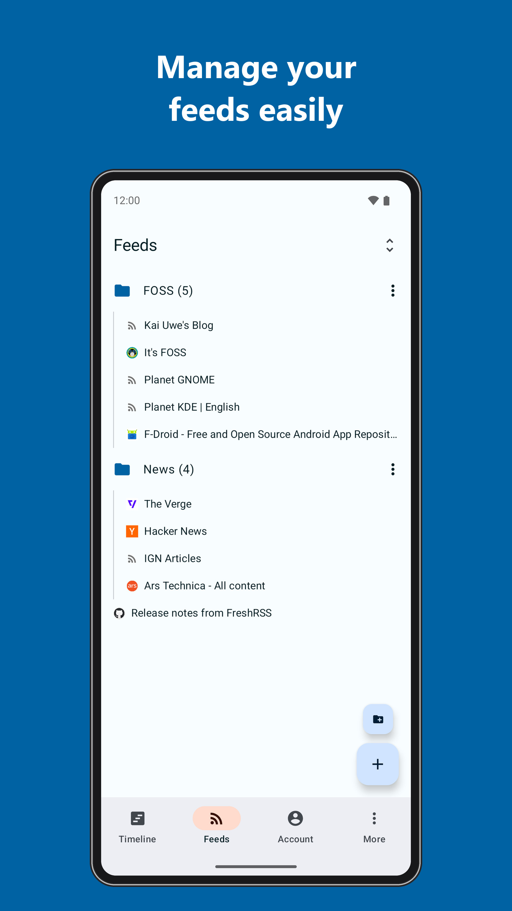
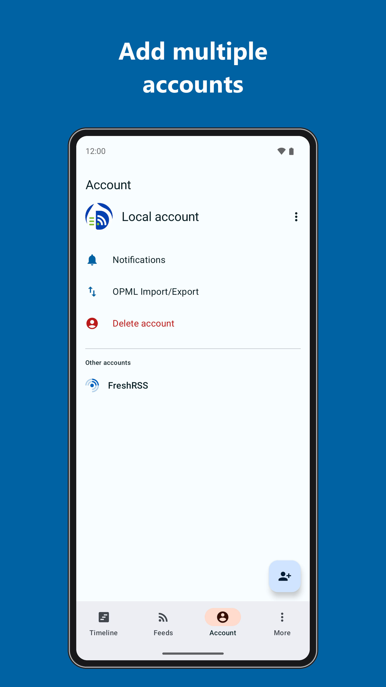
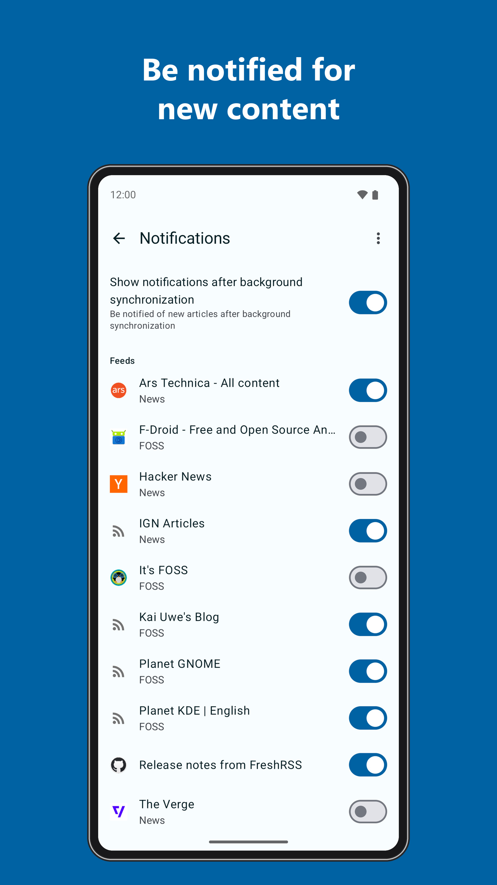
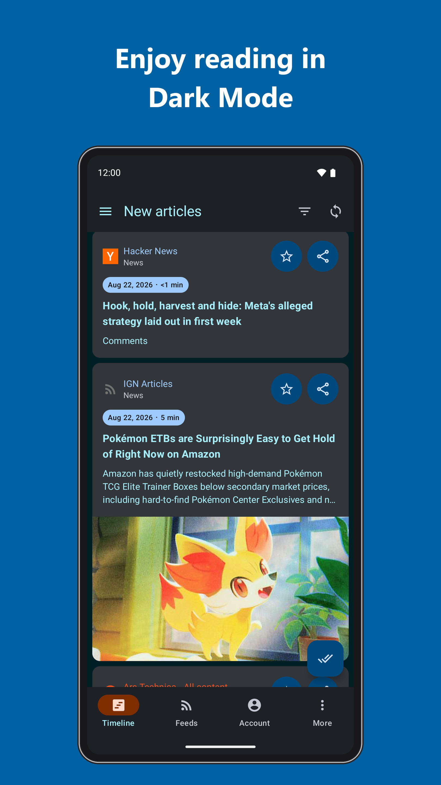

<p align="center">
    
</p>

<h1 align="center"><b>Droidrops</b></h1>

<p align="center">
<a href="https://github.com/thekester/Droidrops/actions"></a>

<h4 align="center">Droidrops is a fork of Readrops, a multi-services RSS client for Android. Its name is composed of "Read" and "drops", where drops are articles in an ocean of news.</h4>

<p align="center">
    <a href="https://github.com/thekester/Droidrops/releases/latest">Latest release</a>
</p>

# Features

- Local RSS parsing (RSS1, RSS2, ATOM, JSONFeed)
- External services:
  - FreshRSS
  - Nextcloud News
  - Fever API
  - Google Reader API
- Multi-account
- Feeds and folders management (create, update and delete feeds/folders if supported by the service API)
- OPML import/export
- Background synchronisation
- Notifications

# Screenshots

   

  

# Licence

This project is released under the GPLv3 licence.

# Develop

During development, you can autofill the app's login form by filling the project's `local.properties` like so:

```properties
debug.<account_type>.login=<login>
debug.<account_type>.password=<password>
debug.<account_type>.url=https\://<your_instance>

# For instance:
debug.nextcloud_news.login=Test user
debug.nextcloud_news.password=1234
debug.nextcloud_news.url=https\://rss.example.com
```

# Fork

Droidrops is maintained as an independent fork of Readrops. The upstream project remains available at https://github.com/readrops/Readrops.

Privacy policy: [PRIVACY_POLICY.md](PRIVACY_POLICY.md)

Publishing notes: [PUBLISHING.md](PUBLISHING.md)
